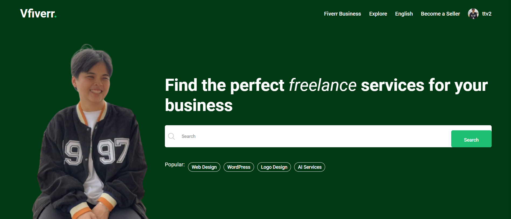
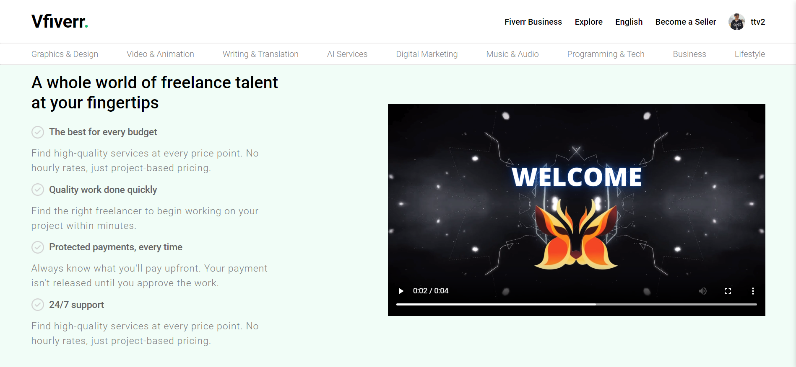

# Website Vfiverr

# Introduction

- Website inspiration from the Fiverr website, is online platform creates connections between buyers and sellers (Network Freelancer).

# My Projects

    

 

    

# Using

- MongoDB: Database Management System
- NodeJS, Express: Back-end
- SCSS: Format Style
- ReactJS: Front-End
- Git & Github: Version Control
